

<picture>
  <source media="(max-width: 600px)" srcset="https://raw.githubusercontent.com/jpinchi/agentfile-support/main/assets/readme/banner-m.svg" />
  
</picture>

 

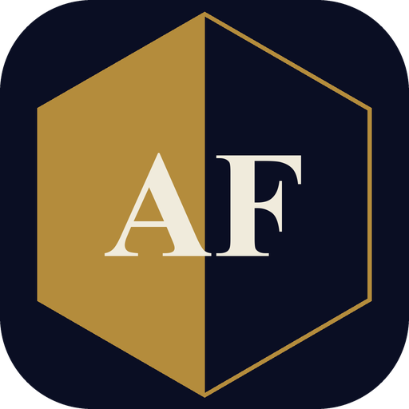

**Agent File** is an iOS app for people preparing for a career with the FBI. Every day it generates a new investigation with AI, and it also includes real federal case studies, interview prep and a live federal job board.

[Inside the app](#preview) · [How a case works](#case) · [Career prep](#career) · [Light and dark](#themes) · [Privacy](#privacy) · [Support](#support)

 

<picture>
  <source media="(max-width: 600px)" srcset="https://raw.githubusercontent.com/jpinchi/agentfile-support/main/assets/readme/h-preview-m.svg" />
  
</picture>

<picture>
  <source media="(max-width: 600px)" srcset="https://raw.githubusercontent.com/jpinchi/agentfile-support/main/assets/readme/preview-m.svg" />
  
</picture>

<b>See every screen</b>

 

<table>
<tr>
<td align="center" width="25%">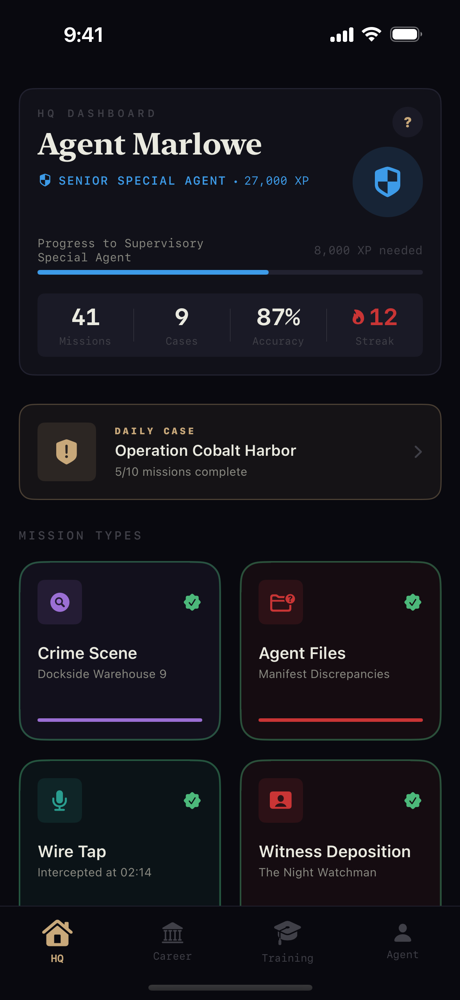 <b>HQ dashboard</b></td>
<td align="center" width="25%">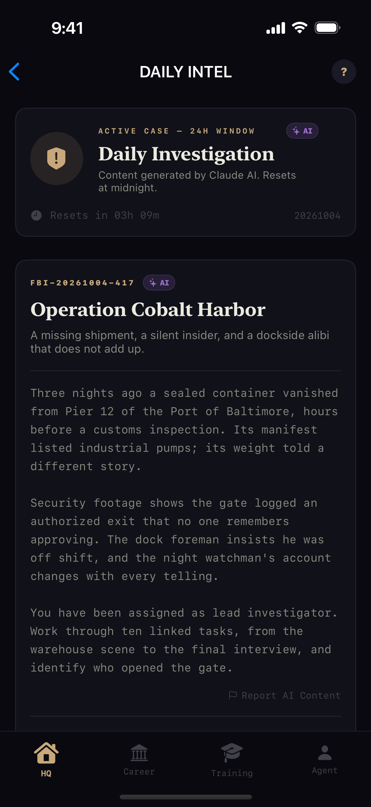 <b>Daily Intel</b></td>
<td align="center" width="25%">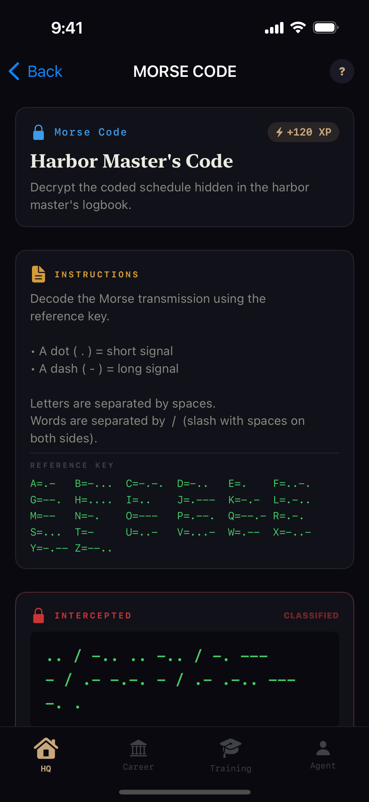 <b>Mission</b></td>
<td align="center" width="25%">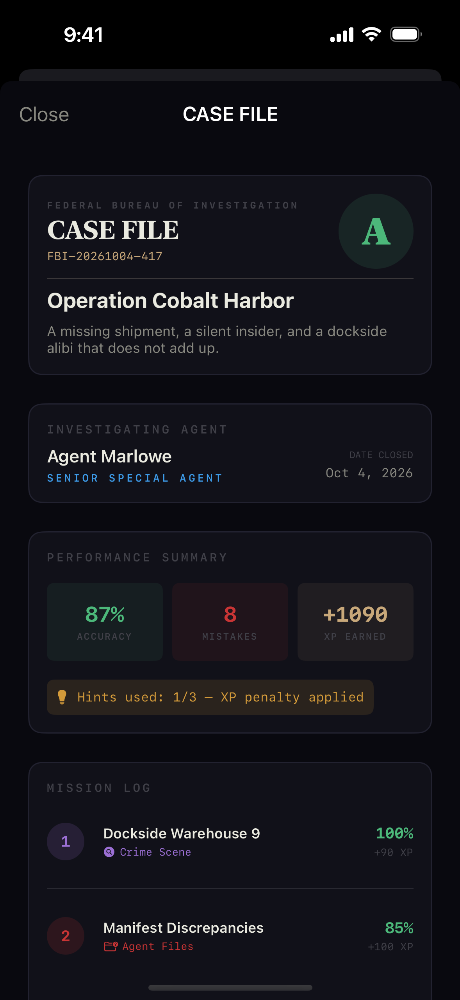 <b>Case file</b></td>
</tr>
<tr>
<td align="center" width="25%">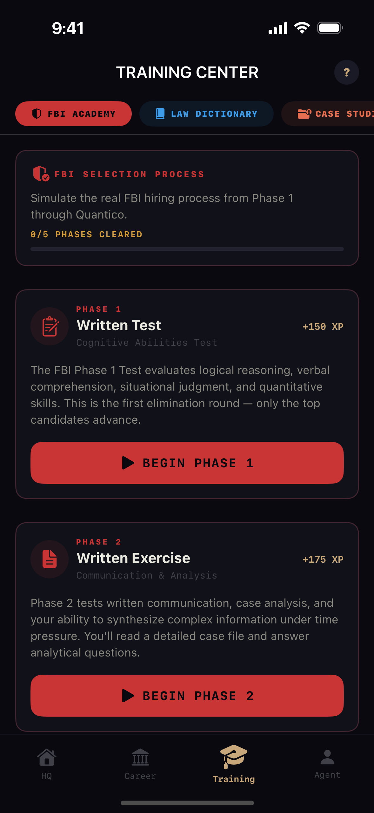 <b>Training Center</b></td>
<td align="center" width="25%">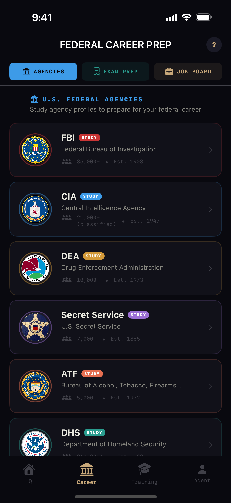 <b>Career Prep</b></td>
<td align="center" width="25%">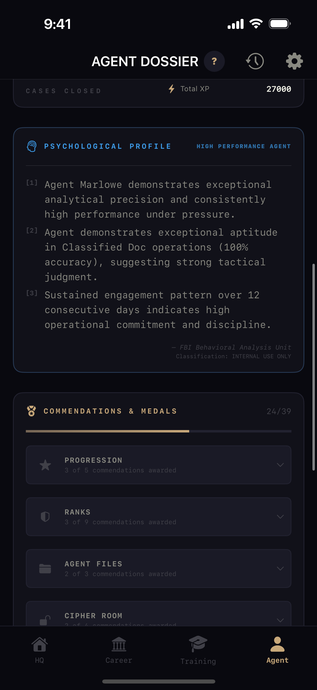 <b>Agent dossier</b></td>
<td align="center" width="25%">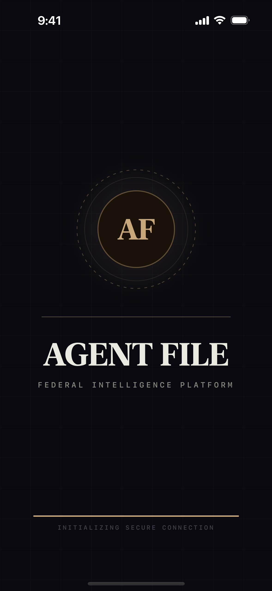 <b>Launch screen</b></td>
</tr>
</table>

 

<picture>
  <source media="(max-width: 600px)" srcset="https://raw.githubusercontent.com/jpinchi/agentfile-support/main/assets/readme/h-case-m.svg" />
  
</picture>

<picture>
  <source media="(max-width: 600px)" srcset="https://raw.githubusercontent.com/jpinchi/agentfile-support/main/assets/readme/case-m.svg" />
  
</picture>

The AI features are powered by Claude (Anthropic) and use your own Anthropic API key from [console.anthropic.com](https://console.anthropic.com).

 

<picture>
  <source media="(max-width: 600px)" srcset="https://raw.githubusercontent.com/jpinchi/agentfile-support/main/assets/readme/h-career-m.svg" />
  
</picture>

<picture>
  <source media="(max-width: 600px)" srcset="https://raw.githubusercontent.com/jpinchi/agentfile-support/main/assets/readme/career-m.svg" />
  
</picture>

 

<picture>
  <source media="(max-width: 600px)" srcset="https://raw.githubusercontent.com/jpinchi/agentfile-support/main/assets/readme/h-themes-m.svg" />
  
</picture>

<picture>
  <source media="(max-width: 600px)" srcset="https://raw.githubusercontent.com/jpinchi/agentfile-support/main/assets/readme/themes-m.svg" />
  
</picture>

<b>See every screen in light mode</b>

 

<table>
<tr>
<td align="center" width="25%">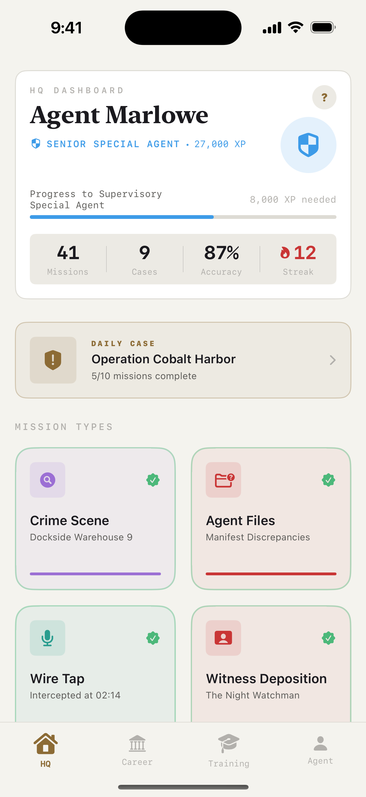 <b>HQ dashboard</b></td>
<td align="center" width="25%">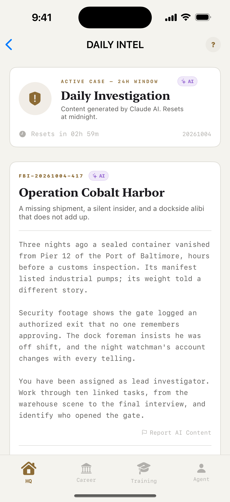 <b>Daily Intel</b></td>
<td align="center" width="25%">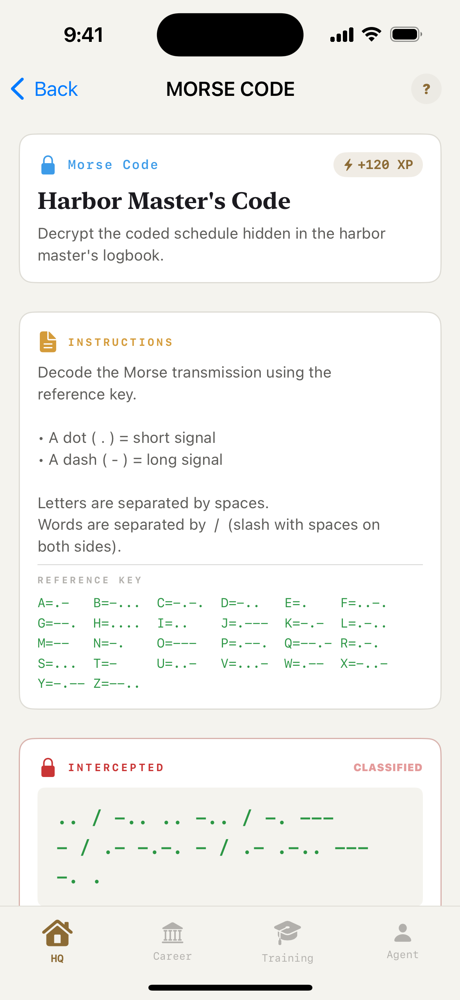 <b>Mission</b></td>
<td align="center" width="25%">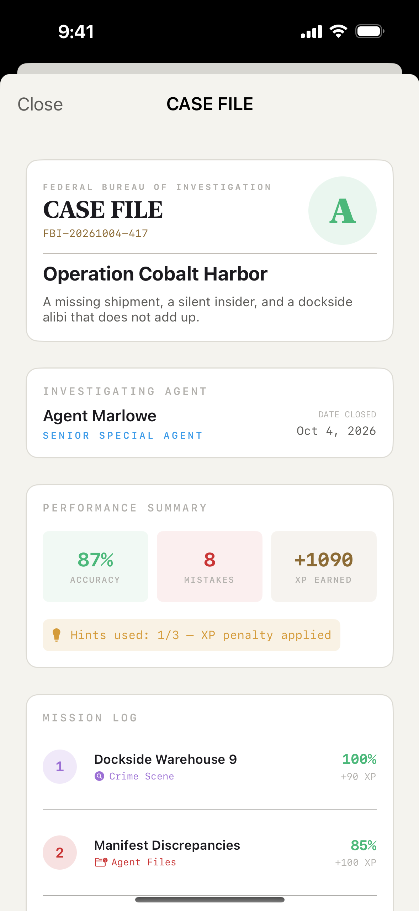 <b>Case file</b></td>
</tr>
<tr>
<td align="center" width="25%">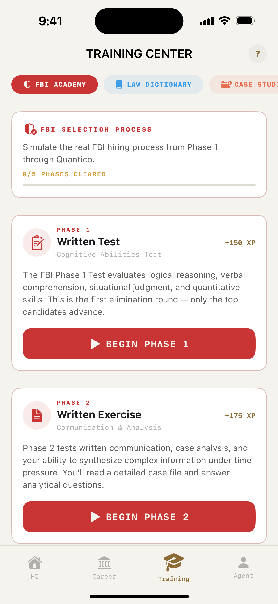 <b>Training Center</b></td>
<td align="center" width="25%">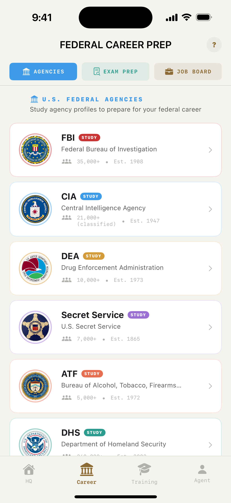 <b>Career Prep</b></td>
<td align="center" width="25%">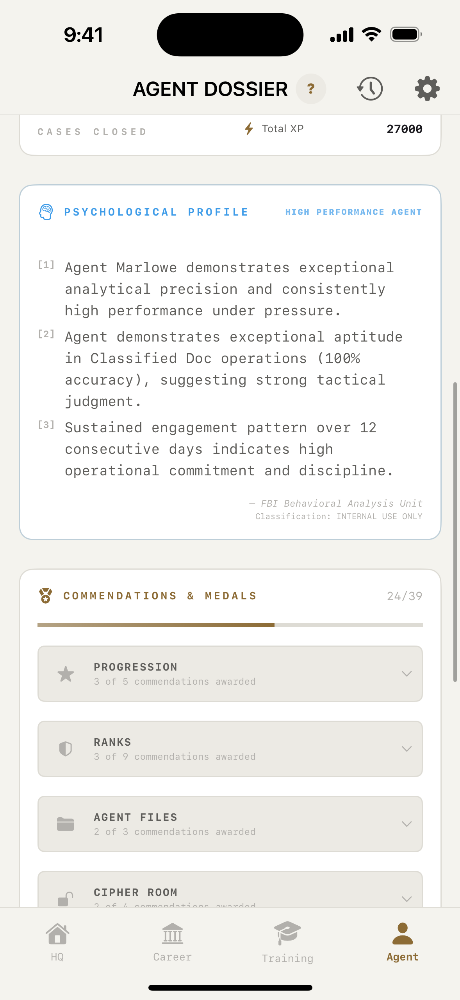 <b>Agent dossier</b></td>
<td align="center" width="25%">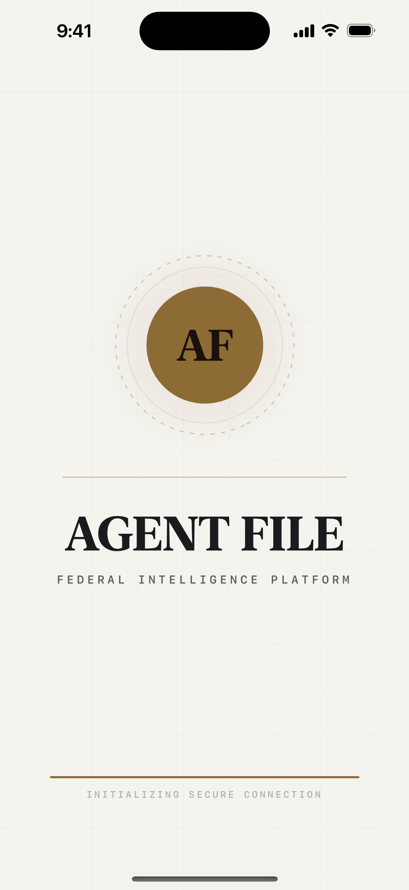 <b>Launch screen</b></td>
</tr>
</table>

 

<picture>
  <source media="(max-width: 600px)" srcset="https://raw.githubusercontent.com/jpinchi/agentfile-support/main/assets/readme/h-privacy-m.svg" />
  
</picture>

<picture>
  <source media="(max-width: 600px)" srcset="https://raw.githubusercontent.com/jpinchi/agentfile-support/main/assets/readme/privacy-m.svg" />
  
</picture>

Your API key and profile data are stored only on your device. Read the full [privacy policy](https://jpinchi.github.io/agent-file-privacy/).

 

<picture>
  <source media="(max-width: 600px)" srcset="https://raw.githubusercontent.com/jpinchi/agentfile-support/main/assets/readme/h-support-m.svg" />
  
</picture>

Questions, issues or feedback: [josueldinhoo@gmail.com](mailto:josueldinhoo@gmail.com). Replies usually arrive within 24–48 hours.

This repository hosts the app's support page ([`index.html`](index.html)).

 

<picture>
  <source media="(max-width: 600px)" srcset="https://raw.githubusercontent.com/jpinchi/agentfile-support/main/assets/readme/footer-m.svg" />
  
</picture>
