**Agent File** is an iOS app for people preparing for a career with the FBI. Every day it generates a new investigation with AI, and it also includes real federal case studies, interview prep and a live federal job board.

This repository hosts the app's support page ([`index.html`](index.html)).

## Features

- **Daily AI investigation** — a new case is created every 24 hours.
- **Real federal case studies**
- **Interview prep**
- **Live federal job board** — powered by USAJOBS.gov

The AI features are powered by Claude (Anthropic) and use your own Anthropic API key from [console.anthropic.com](https://console.anthropic.com).

## Privacy

Agent File does not collect or sell personal data. Your API key and profile data are stored only on your device (the key lives in the iOS Keychain), and the app only connects to the Anthropic API and USAJOBS.gov. Read the full [privacy policy](https://jpinchi.github.io/agent-file-privacy/).

## Support

Questions, issues or feedback: [josueldinhoo@gmail.com](mailto:josueldinhoo@gmail.com). Replies usually arrive within 24–48 hours.
